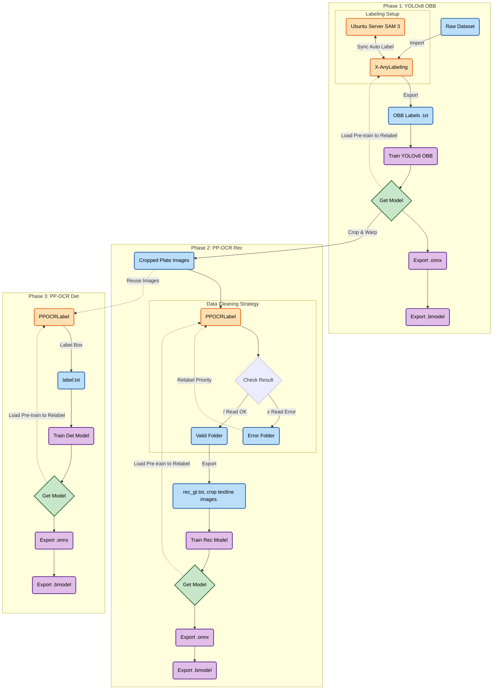

# Thai License Plate Recognition (LPR)  Training Workflow

This document outlines the step-by-step process for training the three core models used in the Thai LPR system:

1. **YOLOv8 OBB** 
2. **PP-OCR (Rec)** 
3. **PP-OCR (Det)** 

---

## 1. Plate Detection Model (YOLOv8 OBB)

**Goal:** Detect and localize the license plate in the image with rotation (Oriented Bounding Box).

### Prerequisites

* **Labeling Tools:** `X-AnyLabeling` (with `X-AnyLabeling-server` for auto-labeling).
* **Framework:** Ultralytics YOLOv8.

### Workflow Steps

1. **Import Dataset:** Gather raw images containing vehicles/license plates.

2. **Labeling (OBB):**
   
   * Open images in **X-AnyLabeling**.
   * Annotate license plates using the "Rotated Bounding Box" tool.
   * Export labels in **YOLO OBB format** (`.txt` files with `class x y w h angle`).

3. **Dataset Preparation:**
   Organize your files into the standard YOLO structure:
   
   ```text
   datasets/
   ├── images/
   │   ├── train/
   │   └── val/
   └── labels/
       ├── train/
       └── val/
   ```
   
   * create **data.yaml** file and set path in that file to locate datasets location, number of class, class name.
   
   * data.yaml example.
     
     ```yaml
     path: /absolute/path/to/datasets
     train: images/train
     val: images/val
     nc: 1
     names: ['license_plate']
     ```

4. **Training:**
   
   * Train the model using the prepared dataset:
     
     ```bash
     yolo obb train model=yolov8s-obb.pt data=path/to/data.yaml batch=64 epochs=100 imgsz=640
     ```

5. **Active Learning (Iterative Loop):**
   
   * Use the newly trained model (`best.pt`) as a pre-trained model in X-AnyLabeling.
   * Run auto-labeling on new images.
   * Manually correct any errors.
   * Re-train the model to improve accuracy.

6. **Export:**
   
   * Once satisfied, export the model to ONNX format for deployment.
     
     ```bash
     yolo export model=best.pt format=onnx opset=12
     ```

---

## 2. Text Recognition Model (PP-OCR Rec)

**Goal:** Read the characters (Thai letters and numbers) from the license plate.

### Prerequisites

* **Tool:** `PPOCRLabel`.
* **Base Model:** Trained YOLOv8 OBB model (from Step 1).
* **Thai dictionary:** contains character for license plate
* **Config Files:** `PP-OCRv5_server_rec.yml` or `PP-OCRv5_mobile_rec.yml`.

### Workflow Steps

1. **Image Pre-processing:**
   
   * Use the **YOLOv8 OBB** model to detect plates.
   * **Crop and Warp:** Crop the detected plate area and apply perspective transform (warp) to make the plate horizontal and rectangular.
   * Save these processed images into a folder.

2. **Labeling:**
   
   * Install and open `PPOCRLabel`.
   * Import the cropped/warped images.
   * Import PP-OCRv5_mobile_rec as pretrained model.
   * Use auto-recognition function to auto-label.
   * Manually correct any errors.
   * **Note:** Ensure Thai characters are labeled correctly.

3. **Export Labels:**
   
   * Export the recognition result in PPOCRLabel.
   * This generates a `rec_gt.txt` file (Format: `image_path \t label`) and Cropped Text Line images.

4. **Training:**
   
   * Configure the training yaml file for the Recognition model.
     
     ```
     PaddleOCR_Dataset/
     ├── train_data/
     │   ├── rec/                      
     │   │   ├── train/                 
     │   │   │   ├── word_001.jpg
     │   │   │   └── ...
     │   │   ├── test/                  
     │   │   │   ├── word_200.jpg
     │   │   │   └── ...
     │   │   └── rec_gt_train.txt       
     │   │   
     │   │
     │   └── det/                       
     │       ├── train/
     │       │   ├── img_001.jpg
     │       │   └── ...
     │       ├── test/
     │       │   ├── img_100.jpg
     │       │   └── ...
     │       └── det_gt_train.txt
     │       
     │
     └── dicts/
     └── th_dict.txt               
     ```
     
     * set path for pretrained model, dictionary, Train data directory, Eval data directory, epoch, etc
     * Train the model using the cropped text line images and `rec_gt.txt`.

5. **Refinement Loop:**
   
   * Use the new Rec model to predict/pre-label new data.
   * Correct the labels in PPOCRLabel.
   * Re-train until the accuracy is satisfactory.

6. **Export Model:**
    *Export to Inference Model:*
    Convert the training checkpoints to an inference model.
   
   ```bash
   python tools/export_model.py -c configs/rec/PP-OCRv5/ch_PP-OCRv5_rec.yml -o Global.pretrained_model=./output/rec/best_accuracy Global.save_inference_dir=./inference/rec/
   ```
   
    *Export Inference model to ONNX format*.
   
   ```bash
   paddle2onnx --model_dir <PATH_TO_INFERENCE_MODEL_FOLDER> \
                 --model_filename inference.pdmodel \
                 --params_filename inference.pdiparams \
                 --save_file <OUTPUT_PATH/model.onnx> \
                 --opset_version 11 \
                 --enable_onnx_checker True
   ```

---

## 3. Text Detection Model (PP-OCR Det)

**Goal:** Locate the text regions (lines of text) within the cropped license plate image.

### Prerequisites

* **Tool:** `PPOCRLabel`.
* **Config Files:** `PP-OCRv5_server_det.yml` or `PP-OCRv5_mobile_det.yml`.

### Workflow Steps

1. **Data Preparation:**
   
   * Use the same cropped license plate images from the Recognition phase.

2. **Labeling:**
   
   * Open `PPOCRLabel`.
   * Draw bounding boxes around each text line/word on the plate (can also use the Label.txt file from Recognition model).
   * Export the result to generate `label.txt` (Det format).

3. **Training Configuration:**
   
   * Select the architecture: **Server** (Accuracy focus) or **Mobile** (Speed focus).
   * Edit the config file (`PP-OCRv5_server_det.yml or PP-OCRv5_mobile_det.yml`) to point to your dataset path.

4. **Training:**
   
   * Run the training script provided by PaddleOCR.
   * Monitor the loss and hmean metrics.

5. **Validation:**
   
   * Test the Det model to ensure it correctly separates lines (e.g., Province name vs. Plate number).

6. **Export Model:**
   
    *Export to Inference Model:*
   
        Convert the training checkpoints to an inference model.
   
   ```bash
   python tools/export_model.py -c configs/det/PP-OCRv5/ch_PP-OCRv5_det.yml -o Global.pretrained_model=./output/det/best_accuracy Global.save_inference_dir=./inference/det/
   ```
   
    *Export Inference model to ONNX format*.
   
   ```bash
   paddle2onnx --model_dir <PATH_TO_INFERENCE_MODEL_FOLDER> \
                   --model_filename inference.pdmodel \
                   --params_filename inference.pdiparams \
                   --save_file <OUTPUT_PATH/model.onnx> \
                   --opset_version 11 \
                   --enable_onnx_checker True
   ```

---

### Summary of Models

| Model Type           | Algorithm  | Input             | Output        | Function                          |
|:-------------------- |:---------- |:----------------- |:------------- |:--------------------------------- |
| **LPR Detection**    | YOLOv8 OBB | Full Image        | Rotated Box   | Finds the plate on the car.       |
| **Text Detection**   | PP-OCR Det | Cropped Plate     | Text Boxes    | Finds where text is on the plate. |
| **Text Recognition** | PP-OCR Rec | Cropped Text Line | String (Text) | Reads the actual characters.      |

